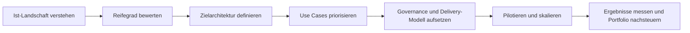

# AI Readiness Blueprint for German Enterprises

Dieses Repository ist ein praxisnahes Blueprint-Projekt dafuer, wie Unternehmen in Deutschland systematisch digitalisierungs- und KI-faehig gemacht werden koennen. Der Fokus liegt auf Konzernen und Mittelstand: von der Analyse der aktuellen IT-Landschaft ueber Priorisierung und Governance bis zur messbaren Umsetzung.

## Why This Repository Exists

Dieses Projekt ist bewusst so aufgebaut, dass es gleichzeitig drei Rollen erfuellt:

- strategisches Showcase fuer GitHub und Bewerbungen
- belastbares Denkmodell fuer digitale Transformation und KI-Einfuehrung
- wiederverwendbares Arbeitsmaterial fuer Assessments, Workshops und Programme

## Ziel

Das Projekt zeigt, wie ein Unternehmen strukturiert in Richtung:

- digitale Exzellenz
- KI-Readiness
- skalierbare Prozessautomatisierung
- modernes Projekt- und Portfoliomanagement
- belastbare Governance und messbare Entscheidungen

transformiert werden kann.

## Fuer wen das gedacht ist

- Geschaeftsfuehrung und Bereichsleitungen
- CIOs, CTOs, CDOs und Transformationsverantwortliche
- Programm- und Projektmanager
- Enterprise Architects
- KI- und Data-Teams
- Beratungen oder interne Transformationseinheiten

## Kernfragen, die dieses Repo beantwortet

- Wie analysiert man die bestehende IT-Landschaft eines Unternehmens sinnvoll?
- Welche Voraussetzungen braucht ein Unternehmen fuer produktive KI-Einfuehrung?
- Welche Use Cases lohnen sich wirklich und wie priorisiert man sie?
- Wie veraendert sich Projektmanagement im KI-Zeitalter?
- Welche Tools decken welche Unternehmensprobleme ab?
- Nach welchen KPIs und Entscheidungslogiken sollte investiert werden?

## Repository-Struktur

- [docs/01-executive-summary.md](/Users/schamilamarkhel/Desktop/ML:AI-Project01/docs/01-executive-summary.md) - Management-Zusammenfassung des Zielbilds
- [docs/02-maturity-model.md](/Users/schamilamarkhel/Desktop/ML:AI-Project01/docs/02-maturity-model.md) - Reifegradmodell fuer Digitalisierung und KI
- [docs/03-assessment-framework.md](/Users/schamilamarkhel/Desktop/ML:AI-Project01/docs/03-assessment-framework.md) - Vorgehen zur Analyse der Ist-Landschaft
- [docs/04-target-operating-model.md](/Users/schamilamarkhel/Desktop/ML:AI-Project01/docs/04-target-operating-model.md) - Ziel-Operating-Model fuer KI-faehige Unternehmen
- [docs/05-ai-use-case-portfolio.md](/Users/schamilamarkhel/Desktop/ML:AI-Project01/docs/05-ai-use-case-portfolio.md) - Use-Case-Portfolio und Priorisierung
- [docs/06-tooling-blueprint.md](/Users/schamilamarkhel/Desktop/ML:AI-Project01/docs/06-tooling-blueprint.md) - Tooling-Empfehlungen nach Domainen
- [docs/07-governance-risk-security.md](/Users/schamilamarkhel/Desktop/ML:AI-Project01/docs/07-governance-risk-security.md) - Governance, Risiko, Compliance, Sicherheit
- [docs/08-kpi-decision-model.md](/Users/schamilamarkhel/Desktop/ML:AI-Project01/docs/08-kpi-decision-model.md) - Metriken und Entscheidungsmodell
- [docs/09-transformation-roadmap.md](/Users/schamilamarkhel/Desktop/ML:AI-Project01/docs/09-transformation-roadmap.md) - Roadmap fuer 12 bis 24 Monate
- [docs/10-example-scenarios.md](/Users/schamilamarkhel/Desktop/ML:AI-Project01/docs/10-example-scenarios.md) - Beispielhafte Anwendung fuer Mittelstand und Konzern
- [docs/11-case-study-mittelstand.md](/Users/schamilamarkhel/Desktop/ML:AI-Project01/docs/11-case-study-mittelstand.md) - konkrete Mittelstands-Fallstudie
- [docs/12-case-study-konzern.md](/Users/schamilamarkhel/Desktop/ML:AI-Project01/docs/12-case-study-konzern.md) - konkrete Konzern-Fallstudie
- [docs/13-github-positioning.md](/Users/schamilamarkhel/Desktop/ML:AI-Project01/docs/13-github-positioning.md) - Positionierung des Repos als Portfolio-Projekt
- [templates/current-state-assessment.md](/Users/schamilamarkhel/Desktop/ML:AI-Project01/templates/current-state-assessment.md) - Vorlage fuer die Ist-Analyse
- [templates/use-case-scorecard.md](/Users/schamilamarkhel/Desktop/ML:AI-Project01/templates/use-case-scorecard.md) - Bewertungslogik fuer KI-Use-Cases
- [templates/ai-governance-checklist.md](/Users/schamilamarkhel/Desktop/ML:AI-Project01/templates/ai-governance-checklist.md) - Governance-Checkliste
- [templates/program-board.md](/Users/schamilamarkhel/Desktop/ML:AI-Project01/templates/program-board.md) - Steuerung eines Transformationsprogramms
- [assets/maturity-model.csv](/Users/schamilamarkhel/Desktop/ML:AI-Project01/assets/maturity-model.csv) - tabellarische Reifegrad-Matrix

## Leitprinzipien

- KI ist kein isoliertes Technologieprojekt, sondern ein Geschaeftsfaehigkeitsprogramm.
- Prozessqualitaet geht vor Automatisierungstiefe.
- Datenqualitaet, Schnittstellen und Verantwortlichkeiten entscheiden ueber Skalierung.
- Security, Compliance und Betriebsmodell muessen von Anfang an Teil der Architektur sein.
- Use Cases werden nach Business-Wert, Umsetzbarkeit und Risiko priorisiert.
- Entscheidungen muessen ueber KPIs, Durchlaufzeiten, Produktivitaet und Ergebnisqualitaet messbar sein.

## Beispielhafter Transformationspfad

## Einsatz dieses Repositories

Dieses Repository kann auf drei Arten genutzt werden:

1. Als oeffentliches Showcase-Projekt auf GitHub.
2. Als Diskussionsgrundlage fuer Kunden, Management oder interne Stakeholder.
3. Als Startpunkt fuer ein spaeteres Beratungsprodukt, eine Workshop-Serie oder eine digitale Assessment-Plattform.

## GitHub Readiness

Fuer eine oeffentliche Veroeffentlichung sind jetzt vorhanden:

- [LICENSE](/Users/schamilamarkhel/Desktop/ML:AI-Project01/LICENSE)
- [CONTRIBUTING.md](/Users/schamilamarkhel/Desktop/ML:AI-Project01/CONTRIBUTING.md)
- klare Dokumentstruktur
- anwendbare Templates
- Fallstudien fuer unterschiedliche Unternehmensrealitaeten
- ein eigenstaendiges PDF-Dossier zur Projektbeschreibung

## Naechste sinnvolle Ausbaustufen

- Website oder GitHub Pages fuer die Inhalte
- Fallstudien fuer Mittelstand und Konzern
- Bewertungs-Tool als Web-App
- Beispielhafte KPI-Dashboards
- Referenzarchitekturen pro Branche

## Lizenz

Zur Zeit ist keine separate Lizenzdatei hinterlegt. Vor der Veroeffentlichung auf GitHub sollte eine passende Open-Source- oder proprietaere Lizenz ergaenzt werden.
